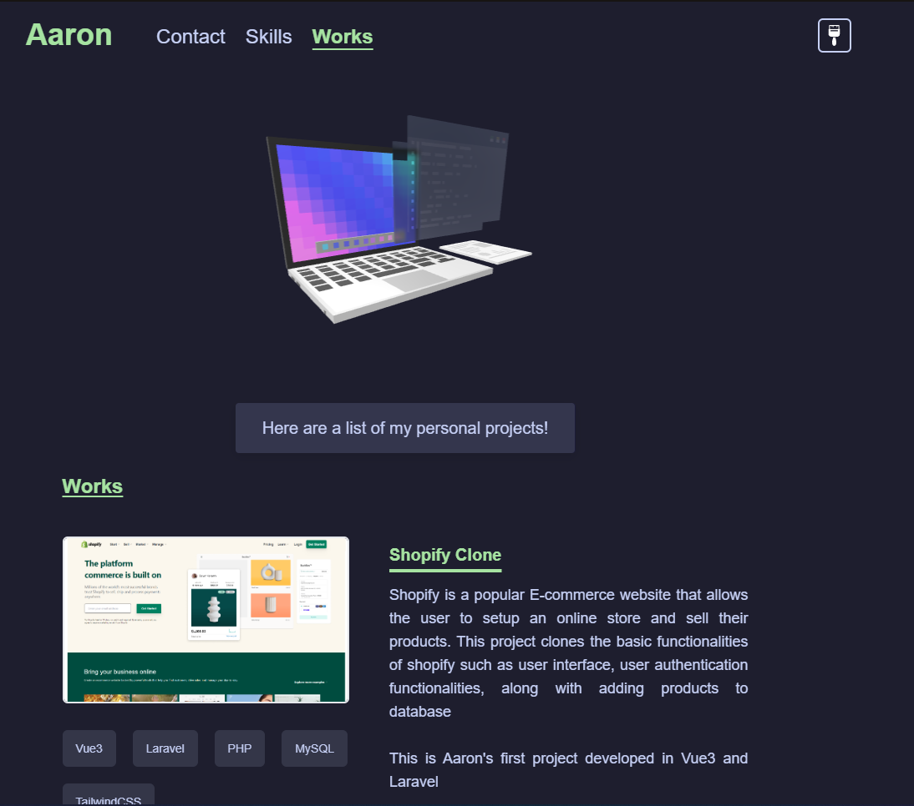

# Portfolio

This is my portfolio powered by Vue3, TailwindCSS, ThreeJS and AnimeJS.

All of the features within this project are frontend only, there are no involvement with any backend frameworks or similar.

View the production deployment of this project on [here](https://kuon-dev-portfolio.vercel.app)

<h2 align="center">
  
  <br>
</h2>


## Featrues 
- Interactive 3D model and UI
- Auto code typing + custom syntax highlighting
- Highly customizable with theme selector
- Flexible responsive design 

---

## Prerequisites
`Git` and `NodeJS` is required. I recommend installing both of these programs through a package manager.

- For Windows, I recommend using `Scoop` [click here](https://scoop.sh)
- For Mac, I recommend using `Homebrew`
- For Linux, use your own distro package manager or `Homebrew` also works

Assuming you are using `Scoop`, you can install the programs through typing these commands on your terminal
```bash
scoop install git
scoop install nodejs
```

For Mac, if you are using `Homebrew`, it will be
```bash
brew install git
brew install <programs> # replace it with the programs to install
```

---
## Get started
Fork this project on Git, after forking the project, clone it into your own local machine.
```bash
git clone https://github.com/<your-git-username>/kuon-portfolio.git
```

initialize the project
```bash
cd kuon-portfolio
npm install
```

now run the project
```bash
npm run dev
```
then visit http://localhost:3000 to view the project.

---
## Folder structure
The folder structure will be something like this
```md
|-  kuon-portfolio
  |- public		
    |- assets
  |- src
    |- components
    |- views 
```

All of your Images will be located on the `public/assets` folder, any other assets such as `.css` files or icons will be located on the `public/.` folder.

Page views (full page, for example `/routes`) will be located on the `src/views` folder. 

Any components that will be shared in the views will be located on the `src/components` folder. If the components get too complicated, then make a new directory in component folder then place your components in that file. 

---
## Customization
### New Page 
When creating a new page, make sure to add a new route on `router.js`, then update the data block of `webRoutes` on `MainNavbar.vue`.

### Modifying contents
Skills and Works (projects) both contain a JSON file on the `components` folder. If you wish to modify only the contents of the pages without touching the UI, you will only need
to modify the JSON file of the related page. Note that the `MainLanding` and `MainContact` does not contain a JSON file, so modifications to the contents will require modifying the
HTML contents of the files.

### New colorscheme
For the color palette, it will contain a JSON file called `Themes.json`. `themeType` refers to the type of the theme whether it is a light theme or a dark theme, meanwhile modifying the
color scheme will change the overall appearance of the web. `DomID` is not relevant as of now. It is recommended to use the hexcode of the color for `colorscheme`, it also works for transparent
hex colors.

---
## Deployment
I recommend using Vercel for deployment as it is simple and contains a lot of features such as preview deployment before production deployment. If you are using VPS for hosting, you need to do the following

```bash
npm run build
```

afterwards you will get a ZIP file, put the ZIP file up on the VPS server according to their relevant instructions.

---
## License
This project is MIT licensed.

You can create your own project and modifying it freely without notifying me under these conditions
- Add a link to this repository that can be easily found and visible in your page.
- Do not use the 3d Model if you do not agree to the license conditions (CC Atribution). [Original Link](https://sketchfab.com/3d-models/voxel-web-development-50ad959d6c6b4799806c45bfa46ca550)
- Do not use it for commercial usage.

Check [LICENSE](./LICENSE) for additional details.
